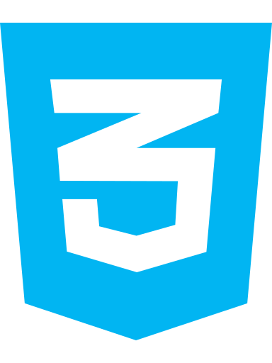
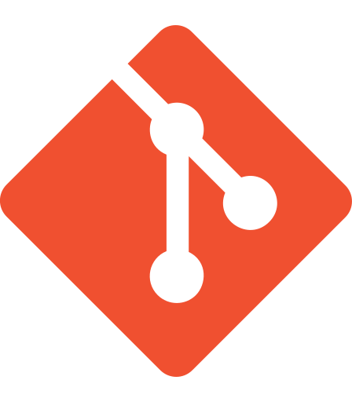

### Hi there, I'm Santiago 👋

## I'm a Front End Developer and Designer!! 🧠✏️💻

- 🔭 Currently finishing the course: Full-Stack Developer in Coder House:   - Web Developing ✔️   - JavaScript ✔️   - React Js ✔️   - BackEnd ⌛
- 🌱 I’m currently learning:    - React Native   - Node.js   - MongoDB   - Express   - SQL   - DbaaS   - GraphQL
- 🥅 2022 Goals: Contribute and gain experience to design useful solutions for the future 🌌
- ⚡ Fun fact: I love sports, read and nature ⛰️

 

## 🧰 Languages and Tools:

<!--  -->

 
 

## 🔗 Connect whit me:

[][instagram]
[][linkedin]

 
 

[linkedin]: https://www.linkedin.com/in/santiago-moyano/
[instagram]: https://www.instagram.com/sanmoyano/?hl=es
